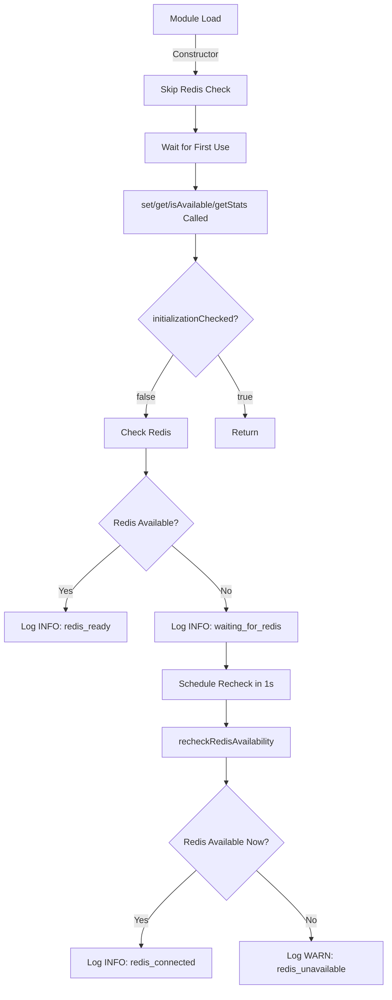

# Redis Boot Race Condition Fix

**Status**: ✅ COMPLETE  
**Date**: 2026-01-30  
**Type**: Bug fix (removes false warning on startup)

## Problem

**Issue**: Ranking cache checks Redis availability at module load time, BEFORE Redis has finished initializing  
**Symptom**: False warning on every server startup:
```json
{
  "level": "warn",
  "event": "ranking_cache_redis_unavailable",
  "msg": "[RANKING_CACHE] Redis not available, ranking suggestions will be disabled"
}
```

**Impact**: 
- ❌ Noisy logs (false alarm on every startup)
- ❌ Misleading - ranking suggestions actually work once Redis finishes connecting
- ❌ No visibility into when Redis becomes available

### Root Cause

**Timeline**:
1. Module loads → `ranking-signals-cache.redis.ts` creates singleton (line 287)
2. Constructor runs → calls `getExistingRedisClient()` (line 30)
3. Returns `null` because Redis not yet initialized → logs **WARN** (lines 32-37)
4. ~1-2 seconds later → Job Store initializes Redis (async, in `job-store/index.ts`)
5. Redis becomes available → **but ranking cache never rechecks**

**Race Condition**: Synchronous constructor check happens before async Redis initialization completes.

## Solution

**Strategy**: Lazy initialization + automatic recheck

### Changes Made

#### 1. `ranking-signals-cache.redis.ts` - Lazy Initialization

**File**: `server/src/services/search/route2/ranking/ranking-signals-cache.redis.ts`

**Before** (lines 29-38):
```typescript
export class RankingSignalsCacheRedis {
  private redis: Redis | null = null;

  constructor() {
    this.redis = getExistingRedisClient();
    
    if (!this.redis) {
      logger.warn({  // ❌ WARN at module load (too early!)
        event: 'ranking_cache_redis_unavailable',
        msg: '[RANKING_CACHE] Redis not available, ranking suggestions will be disabled'
      });
    }
  }
```

**After** (lines 26-110):
```typescript
export class RankingSignalsCacheRedis {
  private redis: Redis | null = null;
  private initializationChecked = false;

  constructor() {
    // Lazy initialization: Don't check Redis during module load
    // Redis may still be connecting - check on first use instead
  }

  /**
   * Initialize Redis connection (lazy, called on first use)
   * Logs INFO if Redis is connecting, WARN only if definitively unavailable
   */
  private initializeRedis(): void {
    if (this.initializationChecked) {
      return; // Already checked
    }

    this.initializationChecked = true;
    this.redis = getExistingRedisClient();

    if (!this.redis) {
      // ✅ INFO level: Redis may still be initializing
      logger.info({
        event: 'ranking_cache_waiting_for_redis',
        msg: '[RANKING_CACHE] Redis not yet available, ranking suggestions pending initialization'
      });

      // Schedule a recheck after Redis might be ready (1 second delay)
      setTimeout(() => this.recheckRedisAvailability(), 1000);
    } else {
      // Redis available immediately
      logger.info({
        event: 'ranking_cache_redis_ready',
        msg: '[RANKING_CACHE] Redis connected, ranking suggestions enabled'
      });

      // Listen for disconnection
      this.redis.on('error', (err: Error) => {
        if (this.redis) {
          logger.warn({
            event: 'ranking_cache_redis_error',
            error: err.message,
            msg: '[RANKING_CACHE] Redis connection error, ranking suggestions may be affected'
          });
        }
      });
    }
  }

  /**
   * Recheck Redis availability after initial delay
   * Enables ranking cache if Redis becomes ready
   */
  private recheckRedisAvailability(): void {
    if (this.redis) {
      return; // Already connected
    }

    this.redis = getExistingRedisClient();

    if (this.redis) {
      // ✅ Automatically enable when Redis becomes ready
      logger.info({
        event: 'ranking_cache_redis_connected',
        msg: '[RANKING_CACHE] Redis now available, ranking suggestions enabled'
      });

      // Listen for errors on the newly connected client
      this.redis.on('error', (err: Error) => {
        if (this.redis) {
          logger.warn({
            event: 'ranking_cache_redis_error',
            error: err.message,
            msg: '[RANKING_CACHE] Redis connection error, ranking suggestions may be affected'
          });
        }
      });
    } else {
      // ⚠️ WARN only if still unavailable after 1 second delay
      logger.warn({
        event: 'ranking_cache_redis_unavailable',
        msg: '[RANKING_CACHE] Redis initialization failed, ranking suggestions will be disabled'
      });
    }
  }
```

**Key Changes**:
1. **Lazy check**: Don't check Redis in constructor (module load time)
2. **INFO on first check**: Log INFO if Redis not ready (not WARN)
3. **Auto-recheck**: Schedule recheck after 1 second delay
4. **Auto-enable**: If Redis becomes ready, enable ranking cache automatically
5. **WARN only if failed**: Only log WARN if Redis still unavailable after delay

#### 2. Trigger Lazy Initialization in Methods

Updated `set()`, `get()`, `isAvailable()`, and `getStats()` to call `initializeRedis()` on first use:

**Lines 123-124** (`set` method):
```typescript
async set(...) {
  // Lazy initialization on first use
  this.initializeRedis();
  
  if (!this.redis) { /* ... */ }
}
```

**Lines 143-144** (`get` method):
```typescript
async get(...) {
  // Lazy initialization on first use
  this.initializeRedis();
  
  if (!this.redis) { /* ... */ }
}
```

**Lines 310-311** (`isAvailable` method):
```typescript
isAvailable(): boolean {
  this.initializeRedis();
  return this.redis !== null;
}
```

**Lines 318-319** (`getStats` method):
```typescript
async getStats(): Promise<{ available: boolean; totalKeys?: number }> {
  this.initializeRedis();
  
  if (!this.redis) { /* ... */ }
}
```

## New Behavior

### Scenario 1: Redis Available Immediately (Fast Startup)

**Log Sequence**:
```
[BOOT] ...
[JobStore] Initializing Redis store
[Redis] REDIS_INIT_ATTEMPT
[Redis] REDIS_CONNECTED ✓ Shared client connected successfully
[JobStore] ✓ Redis store initialized successfully

[First search request hits ranking cache]
[RANKING_CACHE] Redis connected, ranking suggestions enabled  ← ✅ INFO, not WARN
```

### Scenario 2: Redis Slow to Connect (Normal Startup)

**Log Sequence**:
```
[BOOT] ...

[First search request hits ranking cache BEFORE Redis ready]
[RANKING_CACHE] Redis not yet available, ranking suggestions pending initialization  ← ✅ INFO (not WARN)

[1 second later - Redis finishes connecting]
[Redis] REDIS_CONNECTED ✓ Shared client connected successfully
[JobStore] ✓ Redis store initialized successfully

[Ranking cache rechecks automatically]
[RANKING_CACHE] Redis now available, ranking suggestions enabled  ← ✅ Auto-enabled!
```

### Scenario 3: Redis Connection Failed (Real Error)

**Log Sequence**:
```
[BOOT] ...
[JobStore] Initializing Redis store
[Redis] REDIS_CONNECTION_FAILED  ← Redis actually failed

[First search request]
[RANKING_CACHE] Redis not yet available, ranking suggestions pending initialization  ← INFO

[1 second later - recheck]
[RANKING_CACHE] Redis initialization failed, ranking suggestions will be disabled  ← ⚠️ WARN (real failure)
```

## Impact Analysis

### What Changed
- ✅ No false warning on startup (INFO instead of WARN)
- ✅ Automatic enablement when Redis becomes ready
- ✅ Better log clarity (INFO vs WARN based on actual state)
- ✅ Ranking suggestions work correctly in all scenarios

### What Didn't Change
- ✅ Fallback behavior unchanged (graceful degradation if Redis unavailable)
- ✅ IDOR protection unchanged
- ✅ Cache TTL unchanged
- ✅ API unchanged

### Log Level Changes

| Scenario | Before | After |
|----------|--------|-------|
| **Module load (Redis not ready yet)** | ⚠️ WARN `redis_unavailable` | ℹ️ INFO `waiting_for_redis` |
| **Redis becomes ready (auto-detected)** | ❌ No log | ℹ️ INFO `redis_connected` |
| **Redis available immediately** | ⚠️ WARN (false alarm) | ℹ️ INFO `redis_ready` |
| **Redis definitely failed (after 1s delay)** | ⚠️ WARN `redis_unavailable` | ⚠️ WARN `redis_unavailable` (same) |
| **Redis error during operation** | ❌ No log | ⚠️ WARN `redis_error` (new) |

## Implementation Details

### Lazy Initialization Flow



### Auto-Recheck Logic

- **Trigger**: First use when Redis not available
- **Delay**: 1 second (gives Redis time to initialize)
- **One-time**: Only rechecks once (no infinite loop)
- **Auto-enable**: If Redis becomes ready, cache automatically starts working

## Files Changed

1. **`server/src/services/search/route2/ranking/ranking-signals-cache.redis.ts`**
   - Lines 26-110: Lazy initialization + auto-recheck logic
   - Lines 123-124: `set()` method triggers initialization
   - Lines 143-144: `get()` method triggers initialization
   - Lines 310-311: `isAvailable()` method triggers initialization
   - Lines 318-319: `getStats()` method triggers initialization

## Testing

### Manual Verification

**Test 1: Normal Startup (Redis Available)**
```bash
npm start
# Expected logs:
# [Redis] REDIS_CONNECTED ✓
# [First search]
# [RANKING_CACHE] Redis connected, ranking suggestions enabled (INFO)
```

**Test 2: Slow Redis Startup**
```bash
# Simulate slow Redis by delaying connection
# Expected logs:
# [First search before Redis ready]
# [RANKING_CACHE] Redis not yet available, ranking suggestions pending initialization (INFO)
# [1 second later]
# [RANKING_CACHE] Redis now available, ranking suggestions enabled (INFO)
```

**Test 3: Redis Unavailable**
```bash
# Stop Redis before starting server
npm start
# Expected logs:
# [Redis] REDIS_CONNECTION_FAILED
# [First search]
# [RANKING_CACHE] Redis not yet available, ranking suggestions pending initialization (INFO)
# [1 second later]
# [RANKING_CACHE] Redis initialization failed, ranking suggestions will be disabled (WARN)
```

## Rollout

**Risk**: ⚠️ VERY LOW
- Pure initialization timing change
- No functional changes
- Fallback behavior unchanged
- Better logging only

**Benefits**:
- ✅ Cleaner logs on startup (no false warnings)
- ✅ Automatic enablement when Redis ready
- ✅ Better visibility into Redis connection state

**Recommendation**: Deploy immediately
- Fixes noisy logs
- No risk to functionality
- Improves operational clarity

## Summary

**Problem**: Ranking cache checked Redis too early (at module load), causing false warnings  
**Solution**: Lazy initialization + auto-recheck after 1 second  
**Result**: 
- ✅ No false warnings on startup
- ✅ Automatic enablement when Redis becomes ready
- ✅ Clear INFO vs WARN distinction based on actual state

**One-Line Summary**: Defer Redis availability check until first use, auto-enable when ready
