# CI Integration Documentation

**Phase:** 7 (Milestone G)  
**Status:** Implemented  
**Platform:** Bitbucket Pipelines  
**Version:** 1.0.0

---

## Overview

Phase 7 integrates the QA Harness and Legacy Import Fence into Bitbucket Pipelines CI/CD. Every pull request and commit to main/master branches automatically runs regression tests and blocks forbidden imports.

---

## Quick Start

### Prerequisites

1. Bitbucket repository with Pipelines enabled
2. Required environment variables configured
3. QA Harness operational (Phase 6)

### Enable Pipelines

1. Navigate to Repository Settings → Pipelines → Settings
2. Enable Pipelines
3. Commit `bitbucket-pipelines.yml` to repository root

---

## Pipeline Configuration

### File Structure

```
bitbucket-pipelines.yml  # CI configuration (root)
scripts/
  └── check-legacy-imports.sh  # Legacy fence script
server/
  └── src/services/search/qa/
      ├── qa.dataset.json  # Test queries
      ├── run-qa.ts        # QA runner
      └── snapshots/       # Output directory
```

### Pipeline Steps

**1. Legacy Import Fence**
- Checks for forbidden imports in `server/src/services/search/`
- Blocks: `intent.ts`, `nlu.service.ts`, `chatPipeline.ts`, `dialogue/*`, `chat/*`
- Duration: ~5 seconds
- Fails fast if violations found

**2. QA Regression Tests**
- Runs full QA harness (41+ queries)
- Validates system behavior
- Generates snapshot artifacts
- Duration: ~60-90 seconds

### Execution Flow

```mermaid
graph LR
    PR[Pull Request] --> Fence[Legacy Fence]
    Fence -->|Pass| QA[QA Harness]
    Fence -->|Fail| Block1[❌ Block Merge]
    QA -->|Pass| Allow[✅ Allow Merge]
    QA -->|Fail| Block2[❌ Block Merge]
```



---

## Environment Variables

### Required Variables

Add in Bitbucket: Repository Settings → Pipelines → Repository variables

| Variable | Type | Value | Notes |
|----------|------|-------|-------|
| `GOOGLE_MAPS_API_KEY` | Secured | `AIza...` | Google Places API key |
| `PLACES_PROVIDER_MODE` | Plain | `mock` | Use mock provider for stable CI |

### Optional Variables

| Variable | Type | Default | Purpose |
|----------|------|---------|---------|
| `OPENAI_API_KEY` | Secured | (none) | LLM for intent/assistant (optional) |
| `LOG_LEVEL` | Plain | `info` | Logging verbosity |
| `NODE_ENV` | Plain | `production` | Environment mode |

### Setting Variables

1. Go to Repository Settings
2. Navigate to Pipelines → Repository variables
3. Click "Add variable"
4. Enter name and value
5. Check "Secured" for sensitive values (API keys)
6. Save

**Screenshot locations:**
```
Repository Settings
  └── Pipelines
      └── Repository variables
          └── Add variable
```

---

## Pipeline Execution

### Triggers

**Automatic:**
- Every pull request (all branches)
- Every commit to `main` branch
- Every commit to `master` branch

**Manual:**
- Pipelines → Run pipeline
- Select branch
- Click "Run"

### Viewing Results

**1. Pipeline Dashboard:**
```
Repository → Pipelines
```

**2. Pull Request:**
- PR page shows pipeline status
- Green checkmark = passed
- Red X = failed
- Click for details

**3. Commit:**
- Commit page shows pipeline status
- Same visual indicators

### Reading Logs

**Legacy Fence Logs:**
```
🔍 Checking for forbidden legacy imports in server/src/services/search...

Checking pattern: from.*intent\.ts
Checking pattern: from.*nlu\.service\.ts
...

✅ No forbidden imports found
```

**QA Harness Logs:**
```
🧪 Running QA Harness...
📊 Loaded 41 test queries

✅ pizza_tel_aviv_he                         1234ms
✅ pizza_open_now_he                          987ms
...

============================================================
QA HARNESS SUMMARY
============================================================
Total Queries:    41
Passed:           41 ✅
Failed:           0 ❌
============================================================
```

---

## Artifacts

### QA Snapshots

**Location:** `server/src/services/search/qa/snapshots/*.json`

**Retention:** 14 days (Bitbucket default)

**Download:**
1. Go to Pipeline execution
2. Click "Artifacts" tab
3. Download snapshot files

**Format:**
```json
{
  "totalQueries": 41,
  "passed": 41,
  "failed": 0,
  "executionTimeMs": 45678,
  "timestamp": "2025-12-27T15:30:00.000Z",
  "results": [...]
}
```

### Usage

- Compare snapshots over time
- Detect performance regressions
- Debug specific query failures
- Audit system behavior

---

## Troubleshooting

### Pipeline Fails - Missing Environment Variables

**Error:**
```
ConfigError: Missing required configuration: GOOGLE_MAPS_API_KEY
```

**Solution:**
1. Add `GOOGLE_MAPS_API_KEY` to repository variables
2. Mark as "Secured"
3. Re-run pipeline

### Pipeline Fails - Legacy Import Detected

**Error:**
```
❌ FORBIDDEN IMPORT FOUND:
server/src/services/search/orchestrator/search.orchestrator.ts:5:
  import { OldIntent } from '../../legacy/intent.ts';
```

**Solution:**
1. Remove the forbidden import
2. Use new unified search APIs instead
3. Commit and push

**Forbidden Modules:**
- `intent.ts` → Use `IntentService` from capabilities
- `nlu.service.ts` → Use `PlacesIntentService`
- `chatPipeline.ts` → Use `SearchOrchestrator`
- `dialogue/*` → Use `AssistantNarrationService`
- `chat/*` → Use unified search flow

### Pipeline Fails - QA Test Failures

**Error:**
```
❌ pizza_tel_aviv_he                         1234ms
   ⚠️  assertion.minResults: Expected at least 3 results but got 2
```

**Solution:**
1. Check if regression introduced
2. Review recent code changes
3. Fix bug OR update test expectations if behavior changed intentionally
4. Re-run pipeline

### Pipeline Slow - Timeout Issues

**Symptom:** Pipeline takes > 5 minutes

**Causes:**
1. Using real provider instead of mock
2. Network latency
3. Too many retries

**Solutions:**
1. Verify `PLACES_PROVIDER_MODE=mock` is set
2. Check pipeline logs for "MockPlacesProvider initialized"
3. Reduce retry attempts in CI (future enhancement)

### Pipeline Fails - npm ci Error

**Error:**
```
npm ERR! code ENOLOCK
npm ERR! audit This command requires an existing lockfile.
```

**Solution:**
1. Ensure `package-lock.json` is committed
2. Run `npm install` locally to generate
3. Commit and push

---

## Best Practices

### Before Creating PR

```bash
# Run QA locally
cd server
npm run qa

# Check legacy imports
chmod +x scripts/check-legacy-imports.sh
./scripts/check-legacy-imports.sh
```

### Updating QA Dataset

When adding new features:

1. Add corresponding test cases to `qa.dataset.json`
2. Run QA locally to verify
3. Commit dataset changes with feature code
4. CI will validate new tests

### Mock Provider Fixtures

When adding new query patterns:

1. Add fixtures to `places-fixtures.ts`
2. Test locally with `PLACES_PROVIDER_MODE=mock`
3. Verify CI passes with new fixtures

---

## Performance Metrics

### Expected Duration

| Step | Duration | Notes |
|------|----------|-------|
| Setup | 10-20s | npm install, cache |
| Legacy Fence | 5s | Fast grep scan |
| QA Harness | 60-90s | 41 queries, mock mode |
| **Total** | **75-115s** | ~1.5-2 minutes |

### Optimization Tips

1. **Use npm cache:** Already configured in pipeline
2. **Mock mode:** Always use in CI (faster, stable)
3. **Parallel steps:** Not needed for current size
4. **Selective runs:** Run QA only on search/ changes (future)

---

## Extending the Pipeline

### Adding New Steps

Edit `bitbucket-pipelines.yml`:

```yaml
- step: &lint
    name: Lint Check
    script:
      - cd server
      - npm run lint

pipelines:
  default:
    - step: *legacy-fence
    - step: *lint          # NEW
    - step: *qa-harness
```

### Adding Deployment

```yaml
- step: &deploy
    name: Deploy to Staging
    deployment: staging
    script:
      - ./deploy.sh staging

pipelines:
  branches:
    main:
      - step: *legacy-fence
      - step: *qa-harness
      - step: *deploy       # NEW
```

### Conditional Execution

```yaml
- step: &qa-harness
    name: QA Regression Tests
    condition:
      changesets:
        includePaths:
          - "server/src/services/search/**"
    script:
      - cd server
      - npm run qa
```

---

## Migration from Other CI Platforms

### From GitHub Actions

**Bitbucket equivalent:**

| GitHub Actions | Bitbucket Pipelines |
|----------------|---------------------|
| `.github/workflows/` | `bitbucket-pipelines.yml` |
| `on: pull_request` | `pull-requests: '**'` |
| `runs-on: ubuntu-latest` | `image: node:18` |
| `steps:` | `script:` |
| `uses: actions/cache` | `caches: npm` |
| Secrets | Repository variables (secured) |

### From GitLab CI

**Bitbucket equivalent:**

| GitLab CI | Bitbucket Pipelines |
|-----------|---------------------|
| `.gitlab-ci.yml` | `bitbucket-pipelines.yml` |
| `stages:` | `pipelines:` |
| `script:` | `script:` |
| `artifacts:` | `artifacts:` |
| `cache:` | `caches:` |
| CI/CD Variables | Repository variables |

---

## Security Considerations

### Secrets Management

**DO:**
- ✅ Mark API keys as "Secured"
- ✅ Use repository variables, not hardcoded
- ✅ Rotate keys regularly
- ✅ Use different keys for CI vs production

**DON'T:**
- ❌ Commit secrets to repository
- ❌ Log secrets in pipeline output
- ❌ Share keys across environments
- ❌ Use production keys in CI

### Access Control

- Limit who can modify pipeline configuration
- Restrict who can view secured variables
- Audit pipeline execution logs
- Review artifact access permissions

---

## Monitoring & Alerts

### Pipeline Health

**Metrics to track:**
- Pass rate (target: > 95%)
- Average duration (target: < 2 minutes)
- Failure patterns (which tests fail most)
- Artifact size trends

**Bitbucket Insights:**
- Repository → Insights → Pipelines
- View success rate over time
- Identify slow steps
- Track build minutes usage

### Alerts

**Set up notifications:**
1. Repository Settings → Pipelines → Settings
2. Enable "Email notifications"
3. Configure recipients
4. Select events (failures, successes)

---

## References

- [Production Hardening Guide](./PRODUCTION_HARDENING.md)
- [QA Harness Documentation](./QA_HARNESS.md)
- [Bitbucket Pipelines Official Docs](https://support.atlassian.com/bitbucket-cloud/docs/get-started-with-bitbucket-pipelines/)
- [Phase 0 System Definition](./PHASE_0_SYSTEM_DEFINITION.md)

---

**Document Version:** 1.0.0  
**Last Updated:** December 27, 2025  
**Maintained by:** Development Team


