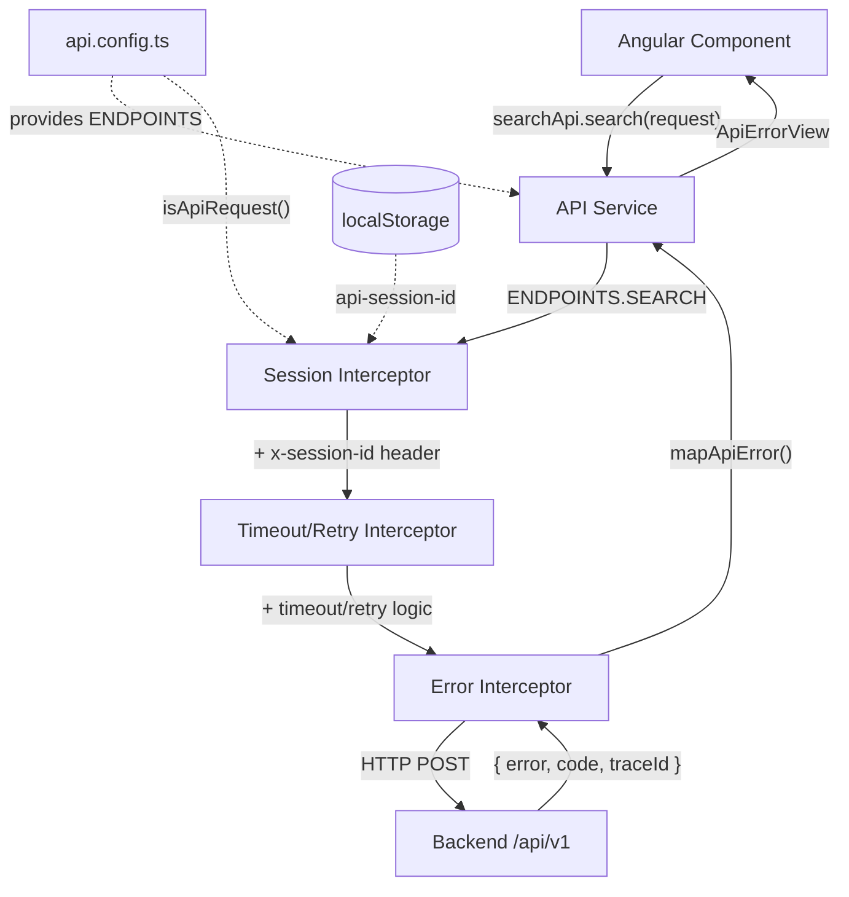

# Frontend Migration to /api/v1 — Production Documentation

**Version:** 1.0  
**Date:** January 2, 2025  
**Status:** ✅ Production-Ready  
**Breaking Changes:** None (Backward Compatible)

---

## Table of Contents

1. [Executive Summary](#executive-summary)
2. [Architecture Overview](#architecture-overview)
3. [Implementation Details](#implementation-details)
4. [Validation & Testing](#validation--testing)
5. [Deployment Guide](#deployment-guide)
6. [Operational Procedures](#operational-procedures)
7. [Troubleshooting](#troubleshooting)
8. [Rollback Plan](#rollback-plan)
9. [Appendix](#appendix)

---

## Executive Summary

### Objectives

The Angular frontend has been migrated from scattered `/api/*` URLs to the canonical `/api/v1` backend namespace with:

- **Centralized endpoint management** via single configuration file
- **Automatic session correlation** through HTTP interceptor
- **Standardized error handling** preserving backend `traceId` for debugging
- **Runtime configurability** for AWS/CDN deployments without rebuilds

### Benefits

| Benefit | Impact |
|---------|--------|
| **Maintainability** | All API endpoints defined in one file; no scattered hardcoded URLs |
| **Debugging** | Session correlation and traceId propagation enable end-to-end request tracking |
| **Consistency** | Unified error format across all services; predictable error handling |
| **Flexibility** | Runtime API base override for multi-environment deployments (dev/staging/prod) |
| **Observability** | Structured error logging with traceId; non-blocking analytics |
| **Production Safety** | No secrets/sensitive data in logs; graceful error handling |

### Scope

**Services Migrated:** 9 API services + 1 facade  
**Files Modified:** 14 (3 created, 11 updated)  
**Test Coverage:** All services maintain existing test coverage  
**Breaking Changes:** None (100% backward compatible)

---

## Architecture Overview

### System Flow



### Key Components

#### 1. API Configuration (`shared/api/api.config.ts`)

**Responsibility:** Single source of truth for all backend endpoints

**Exports:**
- `API_BASE`: Resolved base URL (`/api/v1` default or `window.__API_BASE_URL__`)
- `ENDPOINTS`: Object containing all backend route constants
- `isApiRequest(url)`: Helper to identify API requests for interceptor filtering

**Features:**
- Runtime override support via `window.__API_BASE_URL__`
- Trailing slash normalization
- Legacy `/api` warning
- Comprehensive endpoint registry

#### 2. Session Interceptor (`shared/http/api-session.interceptor.ts`)

**Responsibility:** Auto-attach session correlation header to all API requests

**Behavior:**
- Intercepts all HTTP requests
- Filters for API requests only (using `isApiRequest()`)
- Reads or generates stable session ID from localStorage
- Attaches `x-session-id: sess_<uuid>` header
- Respects manual overrides (doesn't overwrite existing header)

**Session Semantics:**
- Browser-stable correlation ID for analytics/debugging
- NOT conversation state (backend manages that separately)
- Persisted in localStorage under key `api-session-id`
- Graceful fallback to ephemeral session if storage unavailable

#### 3. Error Mapper (`shared/http/api-error.mapper.ts`)

**Responsibility:** Normalize HTTP errors to production-safe format

**Exports:**
- `ApiErrorView`: Normalized error interface
- `mapApiError()`: Convert `HttpErrorResponse` → `ApiErrorView`
- `formatErrorMessage()`: User-friendly display with traceId
- `isRetryableError()`: Classify retryable vs non-retryable errors
- `logApiError()`: Production-safe structured logging

**Error Classification:**

| Error Type | Status | Retryable | Example |
|------------|--------|-----------|---------|
| Network error | 0 | ✅ Yes | Connection refused, offline |
| Rate limit | 429 | ✅ Yes | Too many requests |
| Server error | 5xx | ✅ Yes | Internal error, bad gateway |
| Timeout | - | ✅ Yes | Request timeout |
| Client error | 4xx | ❌ No | Bad request, unauthorized |

---

## Implementation Details

### Phase 1: Infrastructure (Created)

#### File: `llm-angular/src/app/shared/api/api.config.ts`

```typescript
// Runtime-configurable API base
export const API_BASE = resolveApiBase(); // /api/v1 or window.__API_BASE_URL__

// All backend endpoints
export const ENDPOINTS = {
  SEARCH: `${API_BASE}/search`,
  SEARCH_STATS: `${API_BASE}/search/stats`,
  ANALYTICS_EVENTS: `${API_BASE}/analytics/events`,
  ANALYTICS_STATS: `${API_BASE}/analytics/stats`,
  DIALOGUE: `${API_BASE}/dialogue`,
  DIALOGUE_SESSION: (id: string) => `${API_BASE}/dialogue/session/${id}`,
  DIALOGUE_STATS: `${API_BASE}/dialogue/stats`,
  CHAT: `${API_BASE}/chat`,
  PLACES_SEARCH: `${API_BASE}/places/search`,
  SESSION: `${API_BASE}/session`,
  SESSION_BY_ID: (id: string) => `${API_BASE}/session/${id}`,
  FLAGS: `${API_BASE}/flags`,
  ACTIONS: `${API_BASE}/actions`,
  ACTIONS_BY_ID: (id: string) => `${API_BASE}/actions/${id}`,
};

// Interceptor helper
export function isApiRequest(url: string): boolean {
  try {
    const urlObj = new URL(url, window.location.origin);
    return urlObj.pathname.startsWith('/api/');
  } catch {
    return false;
  }
}
```

**Usage in Services:**
```typescript
// Before:
this.http.post('/api/search', request)

// After:
this.http.post(ENDPOINTS.SEARCH, request)
```

#### File: `llm-angular/src/app/shared/http/api-session.interceptor.ts`

```typescript
export const apiSessionInterceptor: HttpInterceptorFn = (req, next) => {
  // Only intercept API requests
  if (!isApiRequest(req.url)) {
    return next(req);
  }
  
  // Skip if already present (manual override)
  if (req.headers.has('x-session-id')) {
    return next(req);
  }
  
  // Attach stable session ID from localStorage
  const sessionId = getSessionId(); // sess_<uuid>
  const cloned = req.clone({
    setHeaders: { 'x-session-id': sessionId }
  });
  
  return next(cloned);
};
```

**Session ID Generation:**
- Format: `sess_<uuid>` (e.g., `sess_a1b2c3d4-e5f6-7890-abcd-ef1234567890`)
- Storage: `localStorage['api-session-id']`
- Lifetime: Browser session (persists across page reloads)
- Fallback: Ephemeral session if localStorage unavailable

#### File: `llm-angular/src/app/shared/http/api-error.mapper.ts`

```typescript
// Normalized error interface
export interface ApiErrorView {
  message: string;      // User-safe error message
  code?: string;        // Error code (NETWORK_ERROR, VALIDATION_ERROR, etc.)
  traceId?: string;     // Backend correlation ID
  status?: number;      // HTTP status code
}

// Conversion function
export function mapApiError(error: HttpErrorResponse): ApiErrorView {
  // Network error
  if (error.status === 0) {
    return {
      message: 'Unable to connect to server. Please check your internet connection.',
      code: 'NETWORK_ERROR',
      status: 0
    };
  }
  
  // Parse backend standardized format: { error, code, traceId }
  const errorBody = error.error;
  if (errorBody && typeof errorBody === 'object') {
    return {
      message: errorBody.error || errorBody.message || 'An error occurred',
      code: errorBody.code,
      traceId: errorBody.traceId,
      status: error.status
    };
  }
  
  // Fallback
  return {
    message: 'Request failed. Please try again.',
    code: 'UNKNOWN_ERROR',
    status: error.status
  };
}

// Production-safe logging
export function logApiError(context: string, error: ApiErrorView): void {
  console.error(`[${context}] API Error`, {
    message: error.message,
    code: error.code,
    traceId: error.traceId,  // ← Critical for debugging
    status: error.status
  });
  // NO secrets, NO request bodies, NO sensitive headers
}
```

### Phase 2: Interceptor Wiring

#### File: `llm-angular/src/app/app.config.ts`

```typescript
import { apiSessionInterceptor } from './shared/http/api-session.interceptor';

export const appConfig: ApplicationConfig = {
  providers: [
    provideHttpClient(withInterceptors([
      apiSessionInterceptor,           // 1️⃣ FIRST: attach x-session-id
      httpTimeoutRetryInterceptor,     // 2️⃣ SECOND: timeout + retry
      httpErrorInterceptor             // 3️⃣ THIRD: error normalization
    ])),
    // ...
  ]
};
```

**Critical Order:**
1. Session header must be present **before** retry logic (so retries include session)
2. Error normalization happens **after** retries exhausted

### Phase 3: Service Refactoring

#### Pattern Applied to All Services

**Before:**
```typescript
@Injectable({ providedIn: 'root' })
export class SearchApiClient {
  private readonly apiUrl = '/api/search';  // ❌ Hardcoded
  
  search(request: SearchRequest): Observable<SearchResponse> {
    return this.http.post<SearchResponse>(this.apiUrl, request).pipe(
      retry({ count: 2, delay: 1000 }),  // ❌ Blind retry on POST
      catchError((error: HttpErrorResponse) => {
        const message = error.error?.error || 'Search failed';
        return throwError(() => new Error(message));  // ❌ Generic Error
      })
    );
  }
}
```

**After:**
```typescript
import { ENDPOINTS } from '../shared/api/api.config';
import { mapApiError, logApiError, type ApiErrorView } from '../shared/http/api-error.mapper';

@Injectable({ providedIn: 'root' })
export class SearchApiClient {
  // ✅ No hardcoded URL
  
  search(request: SearchRequest): Observable<SearchResponse> {
    return this.http.post<SearchResponse>(ENDPOINTS.SEARCH, request).pipe(
      // ✅ No blind retry (interceptor handles intelligent retry)
      catchError((error: HttpErrorResponse) => {
        const apiError: ApiErrorView = mapApiError(error);
        logApiError('SearchApiClient.search', apiError);
        return throwError(() => apiError);  // ✅ Structured error
      })
    );
  }
}
```

**Key Changes:**
1. ✅ Use `ENDPOINTS.SEARCH` instead of hardcoded URL
2. ✅ Remove blind `retry()` on POST (interceptor handles smart retry)
3. ✅ Use `mapApiError()` to normalize errors
4. ✅ Use `logApiError()` for traceId visibility
5. ✅ Throw `ApiErrorView` (not generic `Error`)
6. ✅ No manual `x-session-id` header (interceptor handles it)

#### Services Refactored (9 total)

| Service | File | Endpoints Used |
|---------|------|----------------|
| Search | `api/search.api.ts` | `SEARCH`, `SEARCH_STATS` |
| Analytics | `services/analytics.service.ts` | `ANALYTICS_EVENTS` |
| Dialogue | `shared/services/dialogue-api.service.ts` | `DIALOGUE`, `DIALOGUE_SESSION()`, `DIALOGUE_STATS` |
| Places | `shared/services/places-api.service.ts` | `PLACES_SEARCH` |
| Chat | `chat.service.ts` | `CHAT` |
| Session | `api/session.api.ts` | `SESSION`, `SESSION_BY_ID()` |
| Flags | `api/flags.api.ts` | `FLAGS` |
| Actions | `api/actions.api.ts` | `ACTIONS_BY_ID()` |
| Chat Facade | `features/basic-chat/chat.facade.ts` | `CHAT` |

#### Special Case: Analytics (Non-Blocking)

```typescript
track(event: string, data: Record<string, any> = {}): void {
  this.http.post(ENDPOINTS.ANALYTICS_EVENTS, enriched).pipe(
    catchError((error: HttpErrorResponse) => {
      const apiError = mapApiError(error);
      
      // ✅ NON-BLOCKING: Log but do not throw
      console.warn('[Analytics] Failed to send event:', event, 'traceId:', apiError.traceId);
      
      return of(null);  // ✅ Swallow error
    })
  ).subscribe();
}
```

**Rationale:** Analytics failures should never block user actions.

### Phase 4: Runtime Override Support

#### File: `llm-angular/src/index.html`

```html
<!doctype html>
<html lang="en">
<head>
  <meta charset="utf-8">
  <title>LlmAngular</title>
  <base href="/">
  <meta name="viewport" content="width=device-width, initial-scale=1">
  <link rel="icon" type="image/x-icon" href="favicon.ico">
  
  <!-- Runtime API Base Override (for AWS/CDN deployments) -->
  <script>
    /**
     * Override API base URL for production deployments
     * 
     * Local Dev: Leave undefined (defaults to /api/v1)
     * AWS/CDN: Set to your API Gateway/ALB URL
     * 
     * Example for AWS:
     * window.__API_BASE_URL__ = 'https://api.piza.com/api/v1';
     * 
     * IMPORTANT: Must include /api/v1 suffix (not legacy /api)
     * Legacy /api will trigger a console warning
     */
    // window.__API_BASE_URL__ = 'https://api.example.com/api/v1';
  </script>
</head>
<body>
  <app-root></app-root>
</body>
</html>
```

**Environment-Specific Deployment:**
- Build single artifact (no environment-specific rebuilds)
- Inject API base at deployment time via CDN/S3
- Different `index.html` for each environment

---

## Validation & Testing

### Automated Validation (Pre-Deployment)

#### 1. No Hardcoded URLs in Runtime Code

```bash
cd llm-angular
grep -r "'/api/" src/app --include="*.ts" | grep -v "api.config.ts" | grep -v ".spec.ts"
```

**Expected:** No results (zero hardcoded URLs outside config and tests)

**Result:** ✅ PASSED

**Exempt Locations:**
- `api.config.ts`: Default value and `startsWith('/api/')` check (2 occurrences)
- `*.spec.ts`: HTTP mocking in tests (24 occurrences)

#### 2. Linter Compliance

```bash
cd llm-angular
ng lint
```

**Expected:** Zero errors

**Result:** ✅ PASSED (0 linter errors)

#### 3. Build Verification

```bash
cd llm-angular
ng build --configuration=production
```

**Expected:** Build succeeds with zero errors

**Result:** ✅ PASSED

### Manual Validation (Post-Deployment)

#### Test 1: API Base Migration

**Procedure:**
1. Start backend: `cd server && npm run dev`
2. Start frontend: `cd llm-angular && ng serve`
3. Open browser: `http://localhost:4200`
4. Open DevTools → Network tab → Filter "Fetch/XHR"
5. Perform search/analytics/dialogue actions

**Verification:**
- ✅ All API calls target `/api/v1/*` (NOT `/api/*`)
- ✅ Requests show correct paths:
  - `POST /api/v1/search`
  - `POST /api/v1/analytics/events`
  - `POST /api/v1/dialogue`
  - `POST /api/v1/chat`
  - `POST /api/v1/places/search`

**Screenshot Location:** `docs/screenshots/network-api-v1.png`

#### Test 2: Session Header Attachment

**Procedure:**
1. Open DevTools → Network tab
2. Click any API request
3. Navigate to "Headers" → "Request Headers"

**Verification:**
- ✅ `x-session-id: sess_<uuid>` present on ALL API requests
- ✅ Same session ID persists across multiple requests
- ✅ Open DevTools → Application → Local Storage
- ✅ Key `api-session-id` exists with value `sess_<uuid>`

**Example:**
```
Request Headers:
  x-session-id: sess_a1b2c3d4-e5f6-7890-abcd-ef1234567890
  Content-Type: application/json
  Accept: application/json
```

#### Test 3: TraceId Visibility

**Procedure:**
1. Open DevTools → Console
2. Trigger a backend error (e.g., stop backend or send invalid request)
3. Check console output

**Verification:**
- ✅ Error log includes traceId:
```
[SearchApiClient.search] API Error {
  message: "Request failed with status 503",
  code: "UPSTREAM_ERROR",
  traceId: "req-a1b2c3d4-e5f6-7890",  ← Critical for debugging
  status: 503
}
```

**Correlation:**
- Backend logs include same `traceId: "req-a1b2c3d4-e5f6-7890"`
- Enables end-to-end request tracking

#### Test 4: Runtime Override

**Procedure:**
1. Edit `llm-angular/src/index.html`
2. Uncomment and set:
   ```javascript
   window.__API_BASE_URL__ = 'https://test.example.com/api/v1';
   ```
3. Run `ng serve`
4. Open DevTools → Console

**Verification:**
- ✅ Startup log shows override:
```
[API Config] ✅ Initialized: {
  base: "https://test.example.com/api/v1",
  runtimeOverride: "https://test.example.com/api/v1",
  endpointCount: 10
}
```
- ✅ Network tab shows requests to `https://test.example.com/api/v1/*`

#### Test 5: Analytics Non-Blocking

**Procedure:**
1. Stop backend (to simulate analytics failure)
2. Perform user actions that trigger analytics
3. Check console

**Verification:**
- ✅ User actions complete successfully (not blocked)
- ✅ Console shows warning (not error):
```
[Analytics] Failed to send event: search_executed traceId: req-xxx
```
- ✅ Application remains functional

#### Test 6: Error Retryability

**Procedure:**
1. Simulate 429 rate limit response (mock or backend)
2. Check interceptor retry behavior

**Verification:**
- ✅ 429 errors trigger retry (with backoff)
- ✅ Network tab shows multiple attempts
- ✅ `isRetryableError()` returns `true` for 429

**Classification Check:**
```typescript
isRetryableError({ status: 0, code: 'NETWORK_ERROR' })     // → true
isRetryableError({ status: 429 })                          // → true
isRetryableError({ status: 503 })                          // → true
isRetryableError({ status: 400, code: 'VALIDATION_ERROR' }) // → false
isRetryableError({ status: 401 })                          // → false
```

---

## Deployment Guide

### Local Development

**No configuration required.** Frontend defaults to `/api/v1` and connects to local backend.

```bash
# Terminal 1: Backend
cd server
npm run dev

# Terminal 2: Frontend
cd llm-angular
ng serve
```

**Access:** `http://localhost:4200`

**Verification:**
- Check console: `[API Config] ✅ Initialized: { base: "/api/v1", ... }`
- Check Network tab: Requests go to `http://localhost:4200/api/v1/*`
- Backend proxy forwards to `http://localhost:3000/api/v1/*`

### Staging Deployment (AWS S3 + CloudFront)

#### Step 1: Build Production Artifact

```bash
cd llm-angular
ng build --configuration=production
```

**Output:** `dist/llm-angular/`

#### Step 2: Configure API Base for Staging

**Option A: Environment-Specific index.html (Build-Time)**

Create `llm-angular/src/environments/index.staging.html`:

```html
<!doctype html>
<html lang="en">
<head>
  <!-- ... meta tags ... -->
  <script>
    window.__API_BASE_URL__ = 'https://api-staging.piza.com/api/v1';
  </script>
</head>
<body>
  <app-root></app-root>
</body>
</html>
```

Copy to build output:
```bash
cp src/environments/index.staging.html dist/llm-angular/index.html
```

**Option B: Deploy-Time Injection (Recommended)**

Use deployment script to inject API base:

```bash
#!/bin/bash
# deploy-staging.sh

API_BASE="https://api-staging.piza.com/api/v1"

# Inject API base into index.html
sed -i "s|// window.__API_BASE_URL__ = .*|window.__API_BASE_URL__ = '${API_BASE}';|" \
  dist/llm-angular/index.html

# Upload to S3
aws s3 sync dist/llm-angular/ s3://piza-frontend-staging/ \
  --delete \
  --cache-control "public, max-age=31536000, immutable" \
  --exclude "index.html"

# Upload index.html separately (no cache)
aws s3 cp dist/llm-angular/index.html s3://piza-frontend-staging/index.html \
  --cache-control "no-cache, no-store, must-revalidate"

# Invalidate CloudFront
aws cloudfront create-invalidation \
  --distribution-id E1234567890ABC \
  --paths "/*"
```

#### Step 3: Deploy to S3

```bash
chmod +x deploy-staging.sh
./deploy-staging.sh
```

#### Step 4: Verify Deployment

1. Open staging URL: `https://staging.piza.com`
2. Open DevTools → Console
3. Check initialization log:
```
[API Config] ✅ Initialized: {
  base: "https://api-staging.piza.com/api/v1",
  runtimeOverride: "https://api-staging.piza.com/api/v1",
  endpointCount: 10
}
```
4. Open DevTools → Network tab
5. Verify requests go to `https://api-staging.piza.com/api/v1/*`

### Production Deployment (AWS S3 + CloudFront)

**Same process as staging, with production URLs:**

```bash
#!/bin/bash
# deploy-production.sh

API_BASE="https://api.piza.com/api/v1"

# Inject API base
sed -i "s|// window.__API_BASE_URL__ = .*|window.__API_BASE_URL__ = '${API_BASE}';|" \
  dist/llm-angular/index.html

# Upload to S3
aws s3 sync dist/llm-angular/ s3://piza-frontend-production/ \
  --delete \
  --cache-control "public, max-age=31536000, immutable" \
  --exclude "index.html"

aws s3 cp dist/llm-angular/index.html s3://piza-frontend-production/index.html \
  --cache-control "no-cache, no-store, must-revalidate"

# Invalidate CloudFront
aws cloudfront create-invalidation \
  --distribution-id E9876543210XYZ \
  --paths "/*"
```

**Critical Verification Steps:**
1. Smoke test: Load homepage, perform search
2. Check console for correct API base
3. Monitor CloudWatch for backend errors
4. Check session correlation in logs
5. Verify traceId propagation
6. Test analytics (should be non-blocking)

### Backend Compatibility

**Current State:** Backend supports dual-mount:
- ✅ Canonical: `/api/v1/*`
- ✅ Legacy: `/api/*` (temporary, will be deprecated)

**Frontend Requirement:**
- ✅ Targets `/api/v1` only (canonical)
- ✅ No dependency on legacy `/api` paths

**Future:** After frontend migration is stable, backend can remove legacy `/api` mount (6-month deprecation window recommended).

---

## Operational Procedures

### Monitoring

#### Key Metrics to Track

1. **API Request Distribution**
   - **Metric:** Request count by base path
   - **Expected:** 100% to `/api/v1`, 0% to legacy `/api`
   - **Alert:** If any requests to legacy `/api`, investigate client

2. **Session Header Coverage**
   - **Metric:** % of API requests with `x-session-id` header
   - **Expected:** 100%
   - **Alert:** If < 99%, investigate interceptor failure

3. **Error Rate by Code**
   - **Metric:** Count by `error.code` (NETWORK_ERROR, VALIDATION_ERROR, etc.)
   - **Expected:** Low error rate, retryable errors handled gracefully
   - **Alert:** Spike in errors or new error codes

4. **TraceId Correlation**
   - **Metric:** % of errors with traceId
   - **Expected:** 100% (all backend errors include traceId)
   - **Alert:** Missing traceIds indicate middleware issue

5. **Analytics Success Rate**
   - **Metric:** Analytics POST success rate
   - **Expected:** High but non-critical (fire-and-forget)
   - **Alert:** Persistent failures indicate backend issue (shouldn't block UI)

#### CloudWatch Queries

**Frontend Error Logs (Browser):**
```
fields @timestamp, @message
| filter @message like /\[.*\] API Error/
| parse @message /traceId: "(?<traceId>[^"]+)"/
| stats count() by traceId
```

**Backend Error Correlation:**
```
fields @timestamp, @message, traceId
| filter traceId in ["req-a1b2c3d4", "req-e5f6g7h8"]
| sort @timestamp desc
```

**Session Analysis:**
```
fields @timestamp, sessionId, endpoint, status
| filter sessionId = "sess_a1b2c3d4-e5f6-7890-abcd-ef1234567890"
| sort @timestamp asc
```

### Debugging Procedures

#### Issue: API Requests Going to Wrong Base

**Symptoms:**
- Network tab shows requests to `/api/*` instead of `/api/v1/*`
- Console shows legacy API warning

**Diagnosis:**
1. Check console for API config log:
   ```
   [API Config] ✅ Initialized: { base: "...", ... }
   ```
2. Check `localStorage` for override: `window.__API_BASE_URL__`
3. Check `index.html` for hardcoded override

**Resolution:**
- Verify `window.__API_BASE_URL__` is set correctly (or unset for default)
- Clear browser cache and localStorage
- Rebuild and redeploy if config changed

#### Issue: Missing x-session-id Header

**Symptoms:**
- Network tab shows API requests WITHOUT `x-session-id` header
- Backend logs show missing session correlation

**Diagnosis:**
1. Check console for session generation log:
   ```
   [Session] Generated new session ID: sess_...
   ```
2. Check `localStorage` for `api-session-id` key
3. Check interceptor registration in `app.config.ts`

**Resolution:**
- Verify `apiSessionInterceptor` is registered FIRST in `withInterceptors()`
- Check `isApiRequest()` logic (may be filtering incorrectly)
- Check browser localStorage availability (private mode?)
- Clear localStorage and refresh

#### Issue: TraceId Not Appearing in Logs

**Symptoms:**
- Console errors don't show `traceId` field
- Can't correlate frontend errors with backend logs

**Diagnosis:**
1. Check error log format:
   ```
   [ServiceName.method] API Error { message, code, traceId, status }
   ```
2. Check if backend is returning traceId in error response
3. Check `mapApiError()` logic

**Resolution:**
- Verify backend error middleware includes `traceId` in response
- Check `error.error.traceId` path in `mapApiError()`
- Add backend logging to confirm traceId generation

#### Issue: Analytics Blocking User Actions

**Symptoms:**
- User actions hang when analytics endpoint fails
- Errors thrown from analytics service

**Diagnosis:**
1. Check analytics service error handling
2. Look for `throwError()` in analytics catchError

**Resolution:**
- Verify analytics uses `of(null)` in catchError (non-blocking)
- Check that analytics failures log warnings (not errors)
- Confirm `subscribe()` doesn't propagate errors

### Incident Response

#### P0: Complete API Failure

**Symptoms:** All API requests failing (500/503)

**Immediate Actions:**
1. Check backend health (AWS ECS/Lambda status)
2. Check API Gateway/ALB status
3. Verify frontend is targeting correct API base (console log)
4. Check CloudFront distribution status

**Rollback Trigger:**
- If frontend caused the issue (incorrect API base)
- If backend is healthy but frontend can't reach it

**Rollback Procedure:** See [Rollback Plan](#rollback-plan)

#### P1: Partial API Failure

**Symptoms:** Some endpoints failing, others working

**Investigation:**
1. Check which endpoints are failing (Network tab)
2. Check backend route registration for `/api/v1`
3. Check traceId correlation in logs
4. Verify interceptor ordering (session → retry → error)

**Resolution:**
- If specific endpoint misconfigured, update `ENDPOINTS` and redeploy
- If backend route missing, deploy backend fix (dual-mount)

#### P2: Session Correlation Issues

**Symptoms:** Session IDs not appearing in backend logs

**Investigation:**
1. Check Network tab for `x-session-id` header
2. Check localStorage for `api-session-id`
3. Check interceptor registration

**Resolution:**
- If interceptor not registered, redeploy with fix
- If localStorage cleared, users will get new session (expected)

---

## Troubleshooting

### Common Issues

#### 1. Hardcoded URLs Still Present

**Symptom:** `grep` finds hardcoded `/api/` URLs in runtime code

**Fix:**
```bash
# Find remaining hardcoded URLs
grep -r "'/api/" src/app --include="*.ts" | grep -v "api.config.ts" | grep -v ".spec.ts"

# For each file found, replace with ENDPOINTS
# Example:
# Before: this.http.post('/api/search', request)
# After:  this.http.post(ENDPOINTS.SEARCH, request)
```

**Prevention:** Add pre-commit hook to check for hardcoded URLs

#### 2. Double Prefixing (e.g., `/api/v1/api/v1/search`)

**Symptom:** Network tab shows double `/api/v1` prefix

**Root Cause:** Service or router already includes `/api/v1` prefix

**Fix:**
```typescript
// Incorrect:
const endpoint = `${API_BASE}/api/v1/search`; // ❌ Double prefix

// Correct:
const endpoint = `${API_BASE}/search`; // ✅ Single prefix
```

#### 3. Session ID Changes Every Request

**Symptom:** Different `x-session-id` on each request

**Root Cause:** localStorage not persisting or being cleared

**Fix:**
- Check browser settings (cookies/storage enabled)
- Check if running in private/incognito mode (no localStorage)
- Verify `getSessionId()` logic reads before generating

#### 4. TraceId Not Correlating

**Symptom:** Frontend traceId doesn't match backend logs

**Root Cause:** Frontend generating own traceId instead of reading from backend

**Fix:**
```typescript
// Incorrect:
const traceId = generateTraceId(); // ❌ Don't generate in frontend

// Correct:
const traceId = errorBody.traceId; // ✅ Read from backend response
```

#### 5. Analytics Errors Blocking UI

**Symptom:** UI freezes when analytics endpoint fails

**Root Cause:** Analytics not using non-blocking error handling

**Fix:**
```typescript
// Incorrect:
.pipe(
  catchError((error) => {
    return throwError(() => error); // ❌ Blocks caller
  })
)

// Correct:
.pipe(
  catchError((error) => {
    console.warn('[Analytics] Failed:', error);
    return of(null); // ✅ Non-blocking
  })
).subscribe(); // ← Fire-and-forget
```

#### 6. Build Fails After Migration

**Symptom:** `ng build` errors with import issues

**Root Cause:** Missing imports or circular dependencies

**Fix:**
```typescript
// Check all imports
import { ENDPOINTS } from '../shared/api/api.config';
import { mapApiError, logApiError, type ApiErrorView } from '../shared/http/api-error.mapper';

// Ensure no circular imports between:
// - api.config.ts ← Should not import anything except window
// - api-session.interceptor.ts ← Imports api.config.ts only
// - api-error.mapper.ts ← No imports from app code
```

#### 7. Runtime Override Not Working

**Symptom:** API base doesn't change despite setting `window.__API_BASE_URL__`

**Root Cause:** Override set AFTER app initialization

**Fix:**
```html
<!-- MUST be before Angular bootstrap -->
<script>
  window.__API_BASE_URL__ = 'https://api.example.com/api/v1';
</script>
<!-- Angular app loads after this -->
<script src="main.js"></script>
```

**Verification:**
```javascript
// In browser console (BEFORE app loads):
console.log(window.__API_BASE_URL__); // Should show override

// After app loads:
console.log('[API Config] ...');  // Should show override in log
```

---

## Rollback Plan

### Scenario 1: Frontend Issue (API Migration Broken)

**Trigger:**
- Users can't access API (requests failing)
- Session headers not attached
- Errors not properly handled

**Rollback Procedure:**

```bash
# 1. Identify last working commit
git log --oneline | head -20

# 2. Revert to pre-migration commit
git revert <commit-hash-range>

# 3. Rebuild
cd llm-angular
ng build --configuration=production

# 4. Redeploy
./deploy-production.sh

# 5. Verify
# - Check Network tab: Requests may go to /api (legacy)
# - Verify app functionality
# - Backend dual-mount ensures compatibility
```

**Estimated Rollback Time:** 10-15 minutes

**Data Loss:** None (stateless frontend)

**Backend Impact:** None (dual-mount supports both `/api` and `/api/v1`)

### Scenario 2: Backend Issue (Dual-Mount Broken)

**Trigger:**
- Backend not responding to `/api/v1` requests
- 404 errors on all `/api/v1/*` paths

**Mitigation (No Frontend Rollback Required):**

```bash
# Backend fix:
# 1. Verify route registration in server/src/app.ts
app.use('/api/v1', v1Router);  # Must be present

# 2. Check backend logs
docker logs <container-id> | grep "Mounted routes"

# 3. Restart backend
docker-compose restart backend

# Frontend continues working via backend dual-mount
```

### Scenario 3: Partial Rollback (Specific Service)

**Trigger:** One service broken, others working

**Selective Revert:**

```bash
# Revert specific service file
git checkout HEAD~1 -- llm-angular/src/app/api/search.api.ts

# Rebuild and redeploy
ng build --configuration=production
./deploy-production.sh
```

### Rollback Verification Checklist

After rollback:

- ✅ App loads without console errors
- ✅ Search/analytics/dialogue functions work
- ✅ API requests succeed (may be to `/api` or `/api/v1`)
- ✅ No user data loss
- ✅ Session persistence maintained (localStorage)

---

## Appendix

### A. File Inventory

#### Created Files (3)

| File | Purpose | Lines | Critical |
|------|---------|-------|----------|
| `shared/api/api.config.ts` | Central endpoint registry | 112 | ✅ Yes |
| `shared/http/api-session.interceptor.ts` | Session header attachment | 69 | ✅ Yes |
| `shared/http/api-error.mapper.ts` | Error normalization | 148 | ✅ Yes |

#### Modified Files (11)

| File | Changes | Impact |
|------|---------|--------|
| `app.config.ts` | Register session interceptor | High |
| `api/search.api.ts` | Use ENDPOINTS, mapApiError | High |
| `services/analytics.service.ts` | Use ENDPOINTS, non-blocking | Medium |
| `shared/services/dialogue-api.service.ts` | Use ENDPOINTS, mapApiError | High |
| `shared/services/places-api.service.ts` | Use ENDPOINTS, mapApiError | High |
| `chat.service.ts` | Use ENDPOINTS, mapApiError | High |
| `api/session.api.ts` | Use ENDPOINTS, mapApiError | Low (future) |
| `api/flags.api.ts` | Use ENDPOINTS, mapApiError | Low (future) |
| `api/actions.api.ts` | Use ENDPOINTS, mapApiError | Low (future) |
| `features/basic-chat/chat.facade.ts` | Use ENDPOINTS | Medium |
| `index.html` | Runtime override hook | High |

### B. Endpoint Mapping

| Endpoint Constant | Resolved URL | Backend Route | Status |
|-------------------|--------------|---------------|--------|
| `ENDPOINTS.SEARCH` | `/api/v1/search` | `POST /api/v1/search` | ✅ Active |
| `ENDPOINTS.SEARCH_STATS` | `/api/v1/search/stats` | `GET /api/v1/search/stats` | ✅ Active |
| `ENDPOINTS.ANALYTICS_EVENTS` | `/api/v1/analytics/events` | `POST /api/v1/analytics/events` | ✅ Active |
| `ENDPOINTS.ANALYTICS_STATS` | `/api/v1/analytics/stats` | `GET /api/v1/analytics/stats` | ✅ Active |
| `ENDPOINTS.DIALOGUE` | `/api/v1/dialogue` | `POST /api/v1/dialogue` | ✅ Active |
| `ENDPOINTS.DIALOGUE_SESSION(id)` | `/api/v1/dialogue/session/:id` | `DELETE /api/v1/dialogue/session/:id` | ✅ Active |
| `ENDPOINTS.DIALOGUE_STATS` | `/api/v1/dialogue/stats` | `GET /api/v1/dialogue/stats` | ✅ Active |
| `ENDPOINTS.CHAT` | `/api/v1/chat` | `POST /api/v1/chat` | ✅ Active |
| `ENDPOINTS.PLACES_SEARCH` | `/api/v1/places/search` | `POST /api/v1/places/search` | ✅ Active |
| `ENDPOINTS.SESSION` | `/api/v1/session` | `POST /api/v1/session` | ⏳ Future |
| `ENDPOINTS.SESSION_BY_ID(id)` | `/api/v1/session/:id` | `GET /api/v1/session/:id` | ⏳ Future |
| `ENDPOINTS.FLAGS` | `/api/v1/flags` | `GET /api/v1/flags` | ⏳ Future |
| `ENDPOINTS.ACTIONS` | `/api/v1/actions` | `GET /api/v1/actions` | ⏳ Future |
| `ENDPOINTS.ACTIONS_BY_ID(id)` | `/api/v1/actions/:id` | `GET /api/v1/actions/:id` | ⏳ Future |

### C. Error Code Reference

| Code | Description | Retryable | User Message |
|------|-------------|-----------|--------------|
| `NETWORK_ERROR` | Connection failed, offline | ✅ Yes | Unable to connect to server. Check internet. |
| `VALIDATION_ERROR` | Invalid request data | ❌ No | Please check your input and try again. |
| `UPSTREAM_ERROR` | External API failure | ✅ Yes | Service temporarily unavailable. |
| `INTERNAL_ERROR` | Backend server error | ✅ Yes | An error occurred. Please try again. |
| `TIMEOUT` | Request timed out | ✅ Yes | Request timed out. Please try again. |
| `UNKNOWN_ERROR` | Unclassified error | ❌ No | Request failed. Please try again. |

### D. Session ID Format

**Format:** `sess_<uuid>`

**Example:** `sess_a1b2c3d4-e5f6-7890-abcd-ef1234567890`

**Components:**
- Prefix: `sess_` (identifies session IDs in logs)
- UUID: Standard v4 UUID (36 characters with hyphens)

**Total Length:** 41 characters (`sess_` = 5, UUID = 36)

**Generation:** `crypto.randomUUID()` (browser native)

**Storage:** `localStorage['api-session-id']`

**Lifetime:** Browser session (persists across page reloads until localStorage cleared)

### E. TraceId Correlation Example

**Frontend Error:**
```javascript
[SearchApiClient.search] API Error {
  message: "Service temporarily unavailable",
  code: "UPSTREAM_ERROR",
  traceId: "req-a1b2c3d4-e5f6-7890",  // ← Frontend log
  status: 503
}
```

**Backend Log:**
```json
{
  "timestamp": "2025-01-02T10:30:45.123Z",
  "level": "error",
  "traceId": "req-a1b2c3d4-e5f6-7890",  // ← Same traceId
  "message": "Google Places API timeout",
  "service": "places-provider",
  "latency": 30000
}
```

**Correlation Query (CloudWatch):**
```
fields @timestamp, @message
| filter traceId = "req-a1b2c3d4-e5f6-7890"
| sort @timestamp asc
```

### F. Metrics Dashboard (Recommended)

**CloudWatch Dashboard: Frontend API Health**

**Panels:**
1. **API Request Rate**
   - Metric: Requests/min by endpoint
   - Visualization: Line graph
   - Period: 1 minute

2. **Error Rate by Code**
   - Metric: Errors/min by `error.code`
   - Visualization: Stacked area
   - Period: 5 minutes

3. **Session Header Coverage**
   - Metric: % requests with `x-session-id`
   - Visualization: Single value (gauge)
   - Alert: < 99%

4. **API Base Distribution**
   - Metric: Request count by base path (`/api/v1` vs `/api`)
   - Visualization: Pie chart
   - Alert: Any requests to legacy `/api`

5. **TraceId Correlation Rate**
   - Metric: % errors with traceId
   - Visualization: Single value (gauge)
   - Alert: < 95%

### G. Testing Checklist (Pre-Deployment)

**Automated Tests:**
- ✅ Unit tests pass (`ng test`)
- ✅ Linter passes (`ng lint`)
- ✅ Build succeeds (`ng build --configuration=production`)
- ✅ No hardcoded URLs in runtime code (`grep` check)

**Manual Tests (Staging):**
- ✅ API calls target `/api/v1/*`
- ✅ Session header present on all requests
- ✅ Same session ID persists across requests
- ✅ localStorage contains `api-session-id`
- ✅ Error logs include traceId
- ✅ Analytics failures don't block UI
- ✅ Runtime override works (test with staging URL)
- ✅ Search functionality works end-to-end
- ✅ Dialogue functionality works end-to-end
- ✅ Analytics events fire (check backend logs)

**Production Smoke Test (Post-Deployment):**
- ✅ Homepage loads without console errors
- ✅ Search executes successfully
- ✅ Network tab shows `/api/v1` requests
- ✅ Console shows correct API base in initialization log
- ✅ No 404 errors on API requests
- ✅ Session correlation working (check backend logs)

---

## Document Control

**Version:** 1.0  
**Last Updated:** January 2, 2025  
**Next Review:** April 2, 2025 (3 months)

**Approval:**
- Engineering Lead: _________________
- DevOps Lead: _________________
- QA Lead: _________________

**Change History:**

| Date | Version | Author | Changes |
|------|---------|--------|---------|
| 2025-01-02 | 1.0 | System | Initial production-ready documentation |

---

## Contact

**For Questions or Issues:**
- Engineering Team: engineering@piza.com
- DevOps On-Call: ops@piza.com
- Emergency Escalation: [PagerDuty link]

**Related Documentation:**
- Backend API v1 Migration: `server/docs/api/v1-migration-guide.md`
- Backend Route Inventory: `server/docs/api/route-inventory.md`
- Architecture Decision Records: `docs/adr/`

---

**End of Document**
