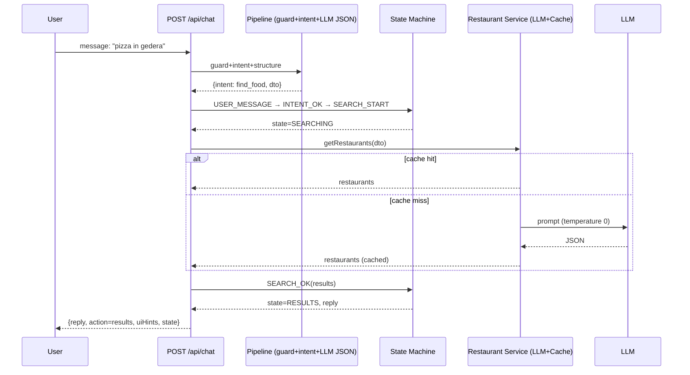

# LLM Pizza Backend – Product / Technical / Business Overview

## What it does (Product/Business)

- Conversational search for food. Users ask in natural language; the system finds relevant restaurants and returns structured results.
- Always-on UX: when data is missing, it asks concise clarification instead of failing.
- Designed to be model-agnostic (OpenAI today; Gemini/local tomorrow) and scalable (session + cache abstractions).

## Entry point (HTTP API)

- `POST /api/chat`
  - Request body: `{ message?: string; patch?: Record<string, unknown>; language?: 'mirror'|'he'|'en'; page?: number; limit?: number }`
  - Headers: `x-session-id` (optional; generated if missing)
  - Response envelope: `{ reply: string; action?: { action: 'results'|'card'|'clarify'|'confirm'|'refuse'; data?: any }, uiHints?: {label:string, patch:object}[], state?: string }`
- The same endpoint supports both free‑text messages (`message`) and structured refinements (`patch`) coming from UI chips.

## Intents

- `find_food` – primary search flow (pizza/sushi/burger/other)
- `order_food` – order-like flow (stub capability)
- `greeting` – hello/onboarding
- `not_food` – off-domain; guardrails nudge/refuse

## High-level architecture

- Controller (`controllers/chat.controller.ts`) orchestrates a request: guard → pipeline → state machine → services → response envelope.
- Pipeline (`services/pipeline/chatPipeline.ts`): intent detection + LLM JSON → localRepair → Zod validation → robust DTO.
- State Machine (`agent/reducer.ts`): pure reducer managing states: COLLECTING, PARTIAL_RESULTS, SEARCHING, RESULTS, NO_RESULTS, QUOTING, CONFIRM, ORDERING, DONE, REFUSAL, ERROR.
- Services:
  - `services/llm/restaurant.service.ts` – LLM-only restaurant list with caching and pagination.
  - `services/openai.client.ts` – OpenAI client (to be wrapped by LLMProvider).
- Store Abstraction (Phase 1):
  - `store/types.ts` – `SessionAgent`, `CacheAgent`; in-memory adapters present; Redis placeholder planned.
- LLM Provider Abstraction (Phase 1):
  - `llm/types.ts` – `LLMProvider.completeJSON(messages, schema, opts)`; OpenAI adapter next.

## Reliability & safety

- Guardrails pre-filter (URLs/code/jailbreak/off-domain/length → nudge/refuse), `x-guard` header.
- Deterministic LLM where needed: `temperature: 0` for caching and reproducibility.
- Timeouts on LLM calls (30s); retry/circuit to be added in provider adapter.
- Zod validation at boundaries; `localRepair()` with synonym mapping/coercion.
- Session persistence via `SessionAgent` (in‑memory now; Redis later).
- Result caching via `CacheAgent` (in‑memory now; TTL per query key).

## Main flow – “Happy path” (free‑text, enough info)



## Clarification flow – “Ask, then refine”

```mermaid
flowchart TD
  A[User: "I'm hungry"] --> B[Guard OK]
  B --> C[Intent low confidence]
  C --> D[State: COLLECTING]
  D --> E[Reply: "What are you looking for?" + chips]
  E --> F[User picks chip: patch {type:'pizza'}]
  F --> G[Controller merges session dto]
  G --> H[State → PARTIAL_RESULTS or SEARCHING]
  H --> I[Restaurant Service → results]
```

## Patch/Refinement flow (UI chips)

- Chips post only `patch` (no free text). Controller merges `{...session.dto, ...patch}` and re-runs the search.
- Same envelope and pagination apply.

## Explore route alignment (frontend)

- `/explore` mirrors the chat results via the same backend endpoint.
- If `q=` is present, it uses `ask(q)`; else it uses `clarify(dto)`; results are shared components.

## Data contracts (selected)

- Food query (legacy shape returned to UI): `{ raw: string; city?: string; type?: 'pizza'|'sushi'|'burger'|'other'; maxPrice?: number; dietary?: string[]; deliveryEtaMinutes?: number }`
- Result vendor row: `{ id: string; name: string; address?: string; price?: number; itemName?: string; description?: string }`

## Roadmap (server)

- Phase 1 (in progress):
  - Store interfaces + in-memory adapters (done)
  - LLMProvider abstraction (done) + OpenAI adapter w/ timeout+retry
- Phase 2 (hardening):
  - Enforce Zod at controller boundaries; log `localRepair` diffs
  - Keep reducer pure; orchestrator handles effects; add tests for guard escalation & PARTIAL_RESULTS→SEARCHING
- Phase 3 (infra):
  - Redis-backed Session/Cache agents; metrics/logging (`pino`, requestId)

---

### Open questions

1. Prioritize next: OpenAI LLMProvider adapter (timeout+retry) or controller boundary schemas/logging?
2. Should we enrich restaurant data with geo coordinates server-side to power accurate maps (Leaflet) instead of client mocks?
3. Do we need multi-intent support (e.g., "pizza and sushi"), or is single-intent per turn enough for now?
